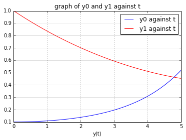

UECM3033 Assignment #3 Report
========================================================

- Prepared by: Connie Liaw Hong Yao
- Tutorial Group: T3

--------------------------------------------------------

## Task 1 --  Gauss-Legendre formula

The reports, codes and supporting documents are to be uploaded to Github at: 

[https://github.com/ConnieLiaw1108/UECM3033_assign3](https://github.com/ConnieLiaw1108/UECM3033_assign3)

Explain how you implement your `task1.py` here.

First, maps the interval [a,b] into [-1,1] to apply the Gaussian Quadrature Rule.
Then, get the weights,x and nodes, y by using the function: x,y = np.polynomial.legendre.leggauss(n).
After that, do the change of variables, we obtain x' and y'.
Finally, apply the Gaussian Quadrature Rule and we are done.

Explain how you get the weights and nodes used in the Gauss-Legendre quadrature.

Get the weights,x and nodes,y by using the function: x,y = np.polynomial.legendre.leggauss(n).

---------------------------------------------------------

## Task 2 -- Predator-prey model

Explain how you implement your `task2.py` here, especially how to use `odeint`.

First, define a function called system to store the ODE system. Then, store the initial value of a, b and y.
Use a linspace function to define the time (0 to 5 years) and then use odeint to solve the system.

Put your graphs here and explain.

Graph of y0 and y1 against t with initial condition y=[0.1, 1.0]

Graph of y1 against y0 with initial condition y=[0.1, 1.0]

Graph of y0 and y1 against t with initial condition y=[0.11, 1.00]

Graph of y1 against y0 with initial condition y=[0.11, 1.00]

Is the system of ODE sensitive to initial condition? Explain.

No because there is only a very small difference between the graphs for different initial conditions.

-----------------------------------

last modified: 17/4/2016
